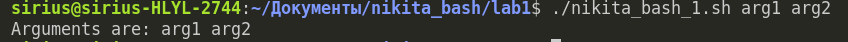
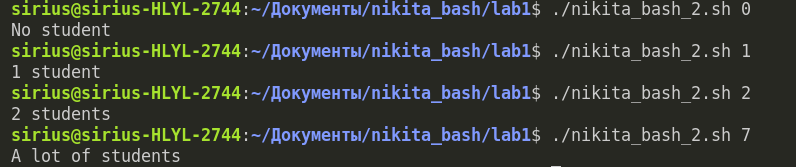
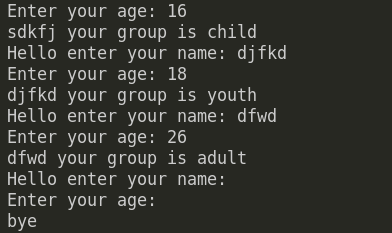
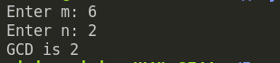

<h1>Лабораторная №1</h1>

<h3><b>Задача 1</b></h3>
Напишите скрипт на bash, который принимает на вход два аргумента и выводит на экран строку следующего вида: Arguments are: $1=первый_аргумент $2=второй_аргумент

<h3><b>Задача 2</b></h3>
Напишите скрипт на bash, который ожидает ввода с клавиатуры один аргумент (целое число от 0 до бесконечности), который будет обозначать число студентов в аудитории. В зависимости от значения числа нужно вывести разные сообщения.

<h3><b>Задача 3</b></h3>
Напишите скрипт на bash, который будет определять в какую возрастную группу попадают пользователи. При запуске скрипт должен вывести сообщение "enter your name:" и ждать от пользователя ввода имени (используйте read, чтобы прочитать его). Когда имя введено, то скрипт должен написать "enter your age:" и ждать ввода возраста (опять нужен read). Когда возраст введен, скрипт пишет на экран "<Имя>, your group is <группа>", где <группа> определяется на основе возраста по следующим правилам: • младше либо равно 16: "child", • от 17 до 25 (включительно): "youth", • старше 25: "adult". После этого скрипт опять выводит сообщение "enter your name:" и всё начинается по новой. Если в какой-то момент работы скрипта будет введено пустое имя или возраст 0, то скрипт должен написать на экран "bye" и закончить свою работу.

<h3><b>Задача 4</b></h3>
Напишите скрипт на bash, который будет искать наибольший общий делитель (НОД, greatest common divisor, GCD) двух чисел. После ввода чисел скрипт считает их НОД и выводит на экран сообщение "GCD is <посчитанное значение>", например, для чисел 15 и 25 это будет "GCD is 5". После этого скрипт опять входит в режим ожидания двух натуральных чисел. Если в какой-то момент работы пользователь ввел вместо этого пустую строку, то нужно написать на экран "bye" и закончить свою работу.

